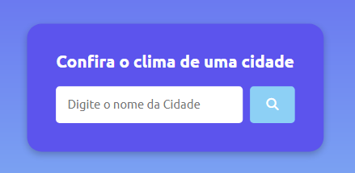
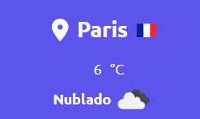

:sun_behind_small_cloud:  :sun_behind_rain_cloud:  :sunny:

# Aplicação de clima com API 
## Nesse projeto teremos um app, com uma interface inteligente, que de acordo com a cidade digitada, informará o clima da cidade, umidade e velocidade dos ventos.

### Na tela inicial, tenos a opção de digitar o nome da cidade, e apertar o botão de busca, que nos dará acesso aos dados.

### Após clicarmos enter, temos na próxima tela, um mostrador detalhado, com as informações dispostas.

### Nome da cidade é indicado com a bndeira de seu país.

### A temperatura fica disponível em graus celsius

### Ainda contamos, com a informação de umidade, e velocidade dos ventos.

